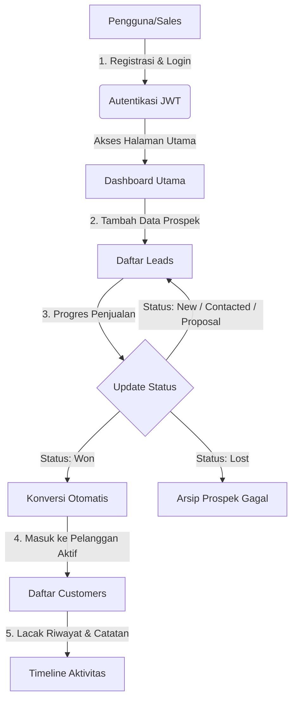

# Relatio CRM — Sistem Manajemen Hubungan Pelanggan (Mini CRM)

Relatio CRM adalah platform Customer Relationship Management (CRM) modern, ringan, dan cepat yang dirancang untuk membantu bisnis kecil, startup, dan tim penjualan mengelola siklus hidup prospek (*leads*) serta pelanggan (*customers*) secara efisien dalam satu tempat terintegrasi.

---

## 💡 Latar Belakang: Mengapa Relatio CRM Dibuat?

Dalam dunia bisnis, hubungan dengan pelanggan adalah kunci utama pertumbuhan. Namun, banyak bisnis mengalami masalah klasik berikut:
1. **Prospek Tercecer & Terlupakan**: Data calon pelanggan (leads) sering dicatat secara manual di spreadsheet atau catatan kertas, sehingga sulit melacak siapa yang sudah dihubungi dan kapan harus melakukan tindak lanjut (*follow-up*).
2. **Kehilangan Riwayat Interaksi**: Anggota tim penjualan kesulitan mengetahui apa saja yang telah dibahas sebelumnya dengan calon pelanggan karena tidak adanya log aktivitas (catatan, email, telepon, rapat).
3. **Proses Konversi yang Lambat**: Mengubah prospek menjadi pelanggan sering kali melibatkan proses administrasi berulang yang memperlambat penutupan penjualan (*closing*).

**Relatio CRM** hadir sebagai solusi digital untuk menyederhanakan alur kerja tersebut. Dengan antarmuka berdesain premium bergaya gelap (*Dark Mode*) yang terinspirasi dari standar industri (seperti Linear, Stripe, dan Vercel), Relatio membantu tim penjualan fokus pada hal yang paling penting: **membangun hubungan dan menutup penjualan.**

---

## 🔄 Alur Kerja Aplikasi (Application Flow)

Aplikasi Relatio CRM memandu pengguna melalui alur bisnis yang logis dari awal penemuan prospek hingga pengelolaan pelanggan aktif:

### 1. Keamanan & Autentikasi (Auth Layer)
*   Sebelum dapat mengakses fitur-fitur CRM, pengguna harus membuat akun atau masuk melalui halaman Login.
*   Sistem menggunakan keamanan **JWT (JSON Web Token)**. Setelah berhasil login, token disimpan di perangkat pengguna (`localStorage`) dan disisipkan secara otomatis di setiap komunikasi dengan server backend (*Axios Interceptors*). Jika token kadaluwarsa, pengguna otomatis dialihkan kembali ke login demi keamanan.

### 2. Manajemen Prospek (Leads Management)
*   Setiap kali ada calon pelanggan potensial (dari iklan, email masuk, atau telepon), pengguna mencatatnya sebagai **Lead**.
*   Pengguna dapat mengisi nama, email, nomor telepon, dan nama perusahaan dari lead tersebut.
*   Lead ini memiliki siklus status yang dapat dipantau:
    *   `New`: Prospek baru masuk, belum dihubungi.
    *   `Contacted`: Sudah ada komunikasi awal.
    *   `Qualified`: Prospek dinilai cocok dengan produk yang ditawarkan.
    *   `Proposal` / `Negotiation`: Penawaran harga dikirim dan sedang dinegosiasikan.

### 3. Konversi Otomatis ke Pelanggan (Won / Convert)
*   **Alur Utama**: Ketika negosiasi berhasil, pengguna cukup mengubah status Lead tersebut menjadi **Won** (Menang).
*   **Sistem Konversi Otomatis**: Frontend Relatio secara cerdas mendeteksi status ini dan langsung memicu pembuatan data baru di tabel **Customers** menggunakan informasi dari lead tersebut (nama, kontak, perusahaan) secara instan. Ini menghemat waktu penjualan dan menghindari input data ganda.

### 4. Manajemen Pelanggan (Customers Management)
*   Semua prospek yang berstatus *Won* akan dipindahkan ke daftar **Customers**. Ini adalah direktori pelanggan aktif perusahaan Anda.
*   Pengguna dapat mengelola detail kontak pelanggan, memperbarui data profil, atau menghapusnya jika kontrak kerja sama telah berakhir.

### 5. Pelacakan Aktivitas & Analitik (Dashboard & Logs)
*   *(Tahap Pengembangan)* Setiap tindakan penjualan (telepon, email terkirim, rapat, catatan khusus) dicatat dalam bentuk linimasa (*Activity Timeline*).
*   Dashboard utama menyajikan ringkasan visual berupa kartu bento (Bento Grid) yang menampilkan metrik penting seperti total prospek aktif, tingkat konversi (*conversion rate*), dan bagan tren pendapatan.

---

## 🛠️ Arsitektur & Teknologi (Tech Stack)

Sistem ini dibangun menggunakan arsitektur modular modern dengan pembagian tugas yang jelas antara frontend dan backend:

### Backend (Server API)
*   **Node.js & Express**: Kerangka kerja server yang cepat dan minimalis.
*   **TypeScript**: Menjamin keamanan tipe data (*type safety*) dan meminimalkan bug runtime.
*   **Prisma ORM**: Penghubung database yang kuat dengan fitur migrasi skema otomatis.
*   **PostgreSQL**: Database relasional tangguh untuk menyimpan data user, leads, customers, dan aktivitas secara aman.

### Frontend (User Interface)
*   **React & Vite**: Bundler modern dengan kecepatan *hot-reloading* instan.
*   **Zustand**: Pengelola state global aplikasi yang ringan untuk menyimpan info user yang sedang aktif login.
*   **Axios**: Klien HTTP untuk melakukan request data ke backend API.
*   **Tailwind CSS v4**: Framework styling utility-first untuk menyusun antarmuka modern yang responsif dan bergaya premium.
