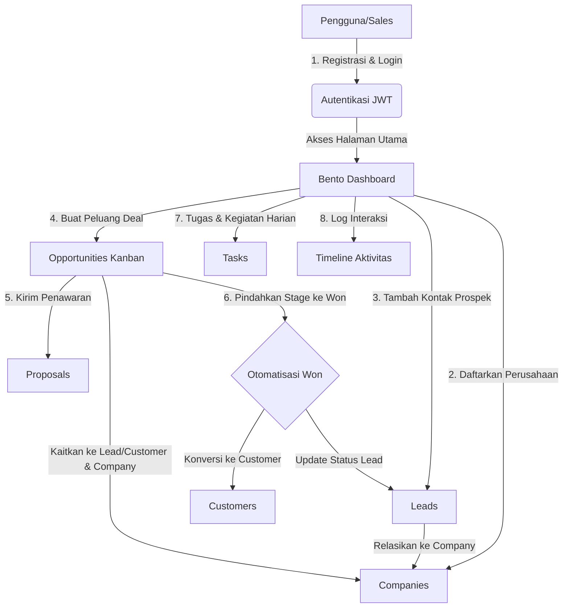

# Relatio CRM — Sistem Manajemen Hubungan Pelanggan (Mini CRM)

Relatio CRM adalah platform Customer Relationship Management (CRM) modern, ringan, dan cepat yang dirancang untuk membantu bisnis kecil, startup, dan tim penjualan mengelola siklus hidup prospek (*leads*), organisasi (*companies*), peluang transaksi (*opportunities*), penawaran (*proposals*), tugas (*tasks*), serta pelanggan (*customers*) secara efisien dalam satu tempat terintegrasi.

---

## 💡 Latar Belakang: Mengapa Relatio CRM Dibuat?

Dalam dunia bisnis, hubungan dengan pelanggan adalah kunci utama pertumbuhan. Namun, banyak bisnis mengalami masalah klasik berikut:
1. **Prospek Tercecer & Terlupakan**: Data calon pelanggan (leads) sering dicatat secara manual di spreadsheet atau catatan kertas, sehingga sulit melacak siapa yang harus dihubungi dan kapan melakukan tindak lanjut (*follow-up*).
2. **Tidak Ada Pengelolaan Institusi**: Kontak prospek tidak terkelompokkan berdasarkan organisasi asal, sehingga sulit memantau hubungan B2B secara terpusat.
3. **Kehilangan Riwayat Interaksi**: Anggota tim penjualan kesulitan mengetahui riwayat bahasan sebelumnya dengan calon pelanggan karena tidak adanya log aktivitas.
4. **Pipeline Penjualan Tidak Terukur**: Sulit melacak potensi keuntungan keuangan dari deal yang sedang berjalan, estimasi penutupan penjualan, dan status penawaran harga (*proposals*).

**Relatio CRM** hadir sebagai solusi digital untuk menyederhanakan alur kerja tersebut. Dengan antarmuka berdesain premium bergaya gelap (*Dark Mode*) yang terinspirasi dari standar industri (seperti Linear, Stripe, dan Vercel), Relatio membantu tim penjualan fokus pada hal yang paling penting: **membangun hubungan dan menutup penjualan.**

---

## 🔄 Alur Kerja Aplikasi (Application Flow)

Aplikasi Relatio CRM memandu pengguna melalui alur bisnis yang logis dari awal pendaftaran organisasi/kontak hingga pengelolaan transaksi:

### 1. Keamanan & Autentikasi (Auth Layer)
*   Sebelum dapat mengakses fitur-fitur CRM, pengguna harus membuat akun atau masuk melalui halaman Login.
*   Sistem menggunakan keamanan **JWT (JSON Web Token)**. Setelah berhasil login, token disimpan di perangkat pengguna (`localStorage`) dan disisipkan secara otomatis di setiap komunikasi dengan server backend (*Axios Interceptors*). Jika token kadaluwarsa, pengguna otomatis dialihkan kembali ke login demi keamanan.

### 2. Manajemen Organisasi (Companies Management)
*   Pengguna dapat mendaftarkan organisasi/instansi bisnis klien, lengkap dengan informasi domain website, nomor telepon kantor, dan alamat.
*   Modul ini menjadi jangkar relasi utama untuk mengelompokkan data Leads, Customers, dan Opportunities.

### 3. Manajemen Prospek (Leads Management)
*   Setiap kali ada calon pelanggan potensial, pengguna mencatatnya sebagai **Lead** dan mengaitkannya dengan salah satu perusahaan yang terdaftar.
*   Halaman Leads dilengkapi dengan **server-side pagination, search, dan status filtering** agar performa pemuatan data tetap instan meskipun data bervolume besar.

### 4. Peluang Penjualan & Kanban Board (Opportunities & Pipeline)
*   Pengguna membuat proyeksi penjualan (**Opportunity**) dengan nominal nilai tertentu ($) dan target tanggal penutupan deal (*close date*).
*   Sistem membatasi relasi Opportunity secara eksklusif (hanya bisa dikaitkan ke salah satu objek: `Lead` untuk negosiasi baru ATAU `Customer` untuk penjualan berulang/upsell).
*   Progres peluang dipantau melalui papan Kanban (*Kanban Board*) interaktif berdasarkan tahapannya: `qualification`, `proposal`, `negotiation`, `won`, atau `lost`.

### 5. Manajemen Penawaran Harga (Proposals Management)
*   Pengguna dapat menyusun, melacak status, dan mengelola dokumen penawaran harga (**Proposals**) yang dikirimkan kepada Leads atau Customers dengan batasan tanggal kedaluwarsa dokumen (*valid until*).

### 6. Otomatisasi Konversi Won (Automatic Won Stage Converter)
*   **Alur Konversi**: Ketika Opportunity dipindahkan ke stage **Won** (penjualan berhasil), backend Relatio secara otomatis akan:
    1. Mengubah status Lead terkait menjadi **Won**.
    2. Membuat entri baru pada tabel **Customers** menggunakan detail profil Lead (nama, kontak, perusahaan) secara instan.
    3. Mengaitkan Opportunity dan Company tersebut dengan Customer baru yang baru saja terbentuk.

### 7. Rencana Tugas & Tindak Lanjut (Tasks Management)
*   Pengguna dapat membuat tugas harian sales (**Tasks**) dengan status (`todo`, `in_progress`, `completed`), deadline, dan tingkat prioritas (*low, medium, high*).
*   Tugas yang selesai dapat dicentang langsung untuk memperbarui statusnya.

### 8. Pelacakan Aktivitas & Analitik (Dashboard & Activity timeline)
*   Setiap log komunikasi (telepon, catatan rapat, memo penting) disimpan dalam linimasa aktivitas (**Activity Timeline**).
*   Bento Dashboard utama menyajikan analitik keuangan terkini secara visual menggunakan Recharts Area Chart, memetakan metrik penting seperti **Won Revenue**, **Pipeline Value** (akumulasi deal aktif), dan total transaksi berjalan.

---

## 🛠️ Arsitektur & Teknologi (Tech Stack)

Sistem ini dibangun menggunakan arsitektur modular modern dengan pembagian tugas yang jelas antara frontend dan backend:

### Backend (Server API)
*   **Node.js & Express**: Server minimalis dengan middleware global error handling terintegrasi.
*   **TypeScript**: Menjamin keamanan tipe data (*type safety*) dan meminimalkan bug runtime.
*   **Zod**: Validasi skema input request pada trust boundary server.
*   **Prisma ORM**: Penghubung database yang kuat dengan fitur migrasi skema otomatis.
*   **PostgreSQL**: Database relasional tangguh untuk menyimpan data user, leads, customers, dan aktivitas secara aman.

### Frontend (User Interface)
*   **React & Vite**: Bundler modern dengan kecepatan *hot-reloading* instan.
*   **Zustand**: Pengelola state global aplikasi yang ringan untuk menyimpan info user yang sedang aktif login.
*   **Axios**: Klien HTTP untuk melakukan request data ke backend API dengan interseptor autentikasi.
*   **Tailwind CSS v4**: Framework styling utility-first untuk menyusun antarmuka modern yang responsif dan bergaya premium.
*   **Lucide React, React Hook Form, Recharts**: Pustaka pendukung rendering chart keuangan, penanganan formulir, dan penyediaan ikon UI modern.
